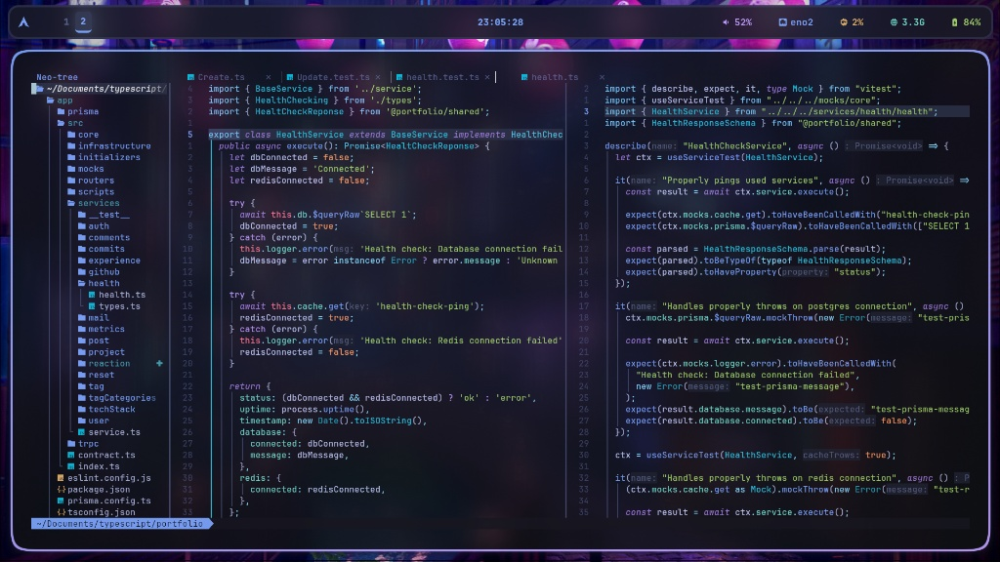

# dotfiles

My personal development environment. Built for productivity or call it whatever you want, featuring a Neovim setup on steroids, a snappy Fish shell, and a modular Hyprland configuration that actually makes sense.

## Preview


*Aesthetics*

## Key Features

*   **Neovim:** Based on LazyVim but heavily customized. It packs custom Lua modules for AI bridging, specialized prompts, and `git-ai-commit` logic—because writing commit messages manually is so 2023.
*   **Modular Hyprland:** Logic is split into dedicated files (animations, keybinds, rules). No massive, bloated config files here; utilized caelestia like keymapping.
*   **Modern CLI Stack:** **Fish Shell** + **Starship**. It’s fast, looks great, and tells me exactly which git branch I'm on.
*   **LSP on Steroids:** Optimized out-of-the-box support for my stuff.
*   **Unified Aesthetics:** Consistent styling across the board—Waybar, Rofi, Kitty, and Hyprland all share a central color palette.
*   **Dev Utilities:** Integrated tools like `codecompanion` for LLM interaction, `conform` for formatting, and specialized action scripts for Rust and Go.

## Installation

### Requirements
Before you dive in, make sure you have these installed:
*   **WM:** Hyprland
*   **Shell:** Fish & Starship
*   **Editor:** Neovim
*   **Terminal:** Kitty
*   **Extras:** Waybar, Rofi, Fastfetch

### Deployment
This repo is designed to be managed with `stow`. To link these configs to your system, clone the repo to your home directory and run:

```bash
git clone https://github.com/robertmon-dev/dotfiles.git
cd dotfiles

stow nvim
stow hypr
# ...and so on for other modules
```

## Configuration

### Neovim AI Integration
The AI features rely on my separate `nvim-engine` project (check that repo for the binary; the `Makefile` there is your friend). You'll need to export your API keys in your shell. You can pass multiple keys as comma-separated values:

```bash
export GEMINI_API_KEYS="your_key_1,your_key_2"
export ANTHROPIC_API_KEYS="your_key_1,your_key_2,your_key_3"
```

### Project Structure
The repo mirrors a standard `.config` layout:

```text
.
├── fastfetch         # System info layout
├── fish              # Shell config & custom functions
├── git               # Global .gitconfig and local overrides
├── hypr              # Hyprland, hyprlock, hyprpaper, and helper scripts
├── kitty             # GPU-accelerated terminal config
├── nvim              # The heart (LazyVim + AI + LSP modules)
├── rofi              # App launcher & theme
├── starship          # Cross-shell prompt config
└── waybar            # Status bar CSS and JSON modules
```

## Highlights within Neovim

*   `lua/configs/keymaps.lua`: Where the magic happens. All my main keybindings live here.
*   `lua/configs/autocmds.lua`: Autocommands and a few specific keybindings kept here to avoid re-importing everything and to keep me sane.
*   `lua/functions/ai/`: The core logic for the AI bridge and custom prompt engineering.
*   `lua/lsp/`: Per-language server configs to ensure peak performance without the bloat.
*   `lua/plugins/`: A curated list of plugins, including `codecompanion.lua` for that sweet LLM interaction.

## Support & Scripts

*   **Keybinds:** Hyprland shortcuts are located in `hypr/.config/hypr/conf/keybinds.conf`. To quickly list active system shortcuts, just hit `SUPER + H`.
*   **LSP Logs:** If Neovim is acting up, check the standard LSP logs at `~/.local/state/nvim/lsp.log`.

---
